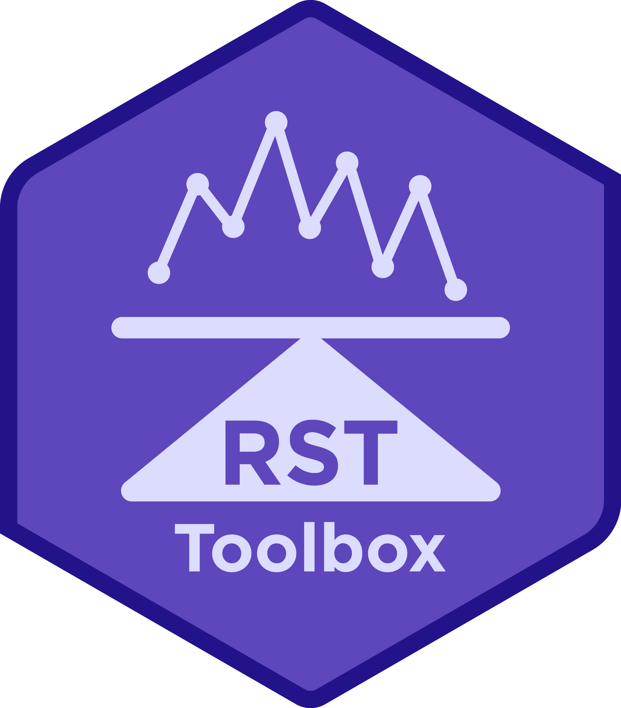

<h1 align="center">
  <a href="https://github.com/CEHI-code-repos/RateStabilizingToolbox">
    Rate Stabilizing Toolbox 
  </a>
</h1>

  <strong>Generate reliable, local-level age-standardized measures of chronic disease </strong>

## Set up

1.  Download the [latest release](https://github.com/CEHI-code-repos/RateStabilizingToolbox/releases/latest)'s zip file
2.  Unzip the zip file
3.  Open up a Map Project within ArcGIS Pro. 
4.  Within the Catalog Pane, right click on thse Toolboxes and Add Toolbox. 
5.  Navigate to where you have downloaded and extracted the RSTbx and find the *rate_stabilizing_toolbox.pyt*.  

Want to explore additional Conditional Autoregressive (CAR) models? Check
out the [RSTr package](https://cehi-code-repos.github.io/RSTr/).

## Documentation

Check out the [Documentation](https://cehi-code-repos.github.io/RateStabilizingToolbox).
