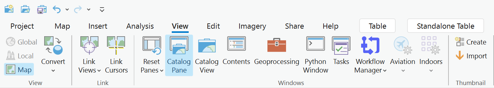
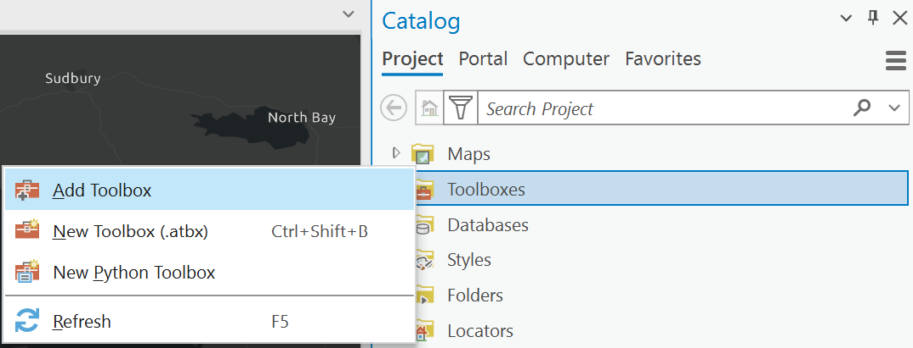
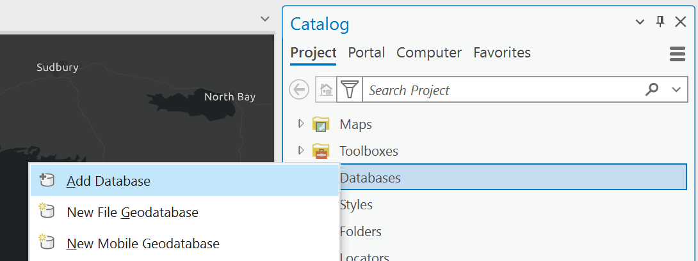
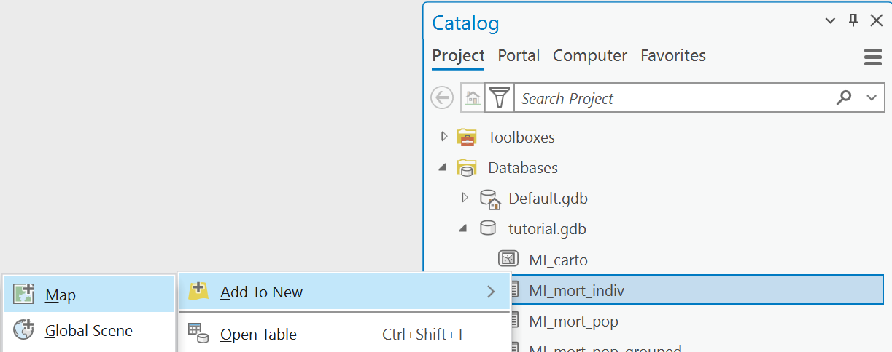
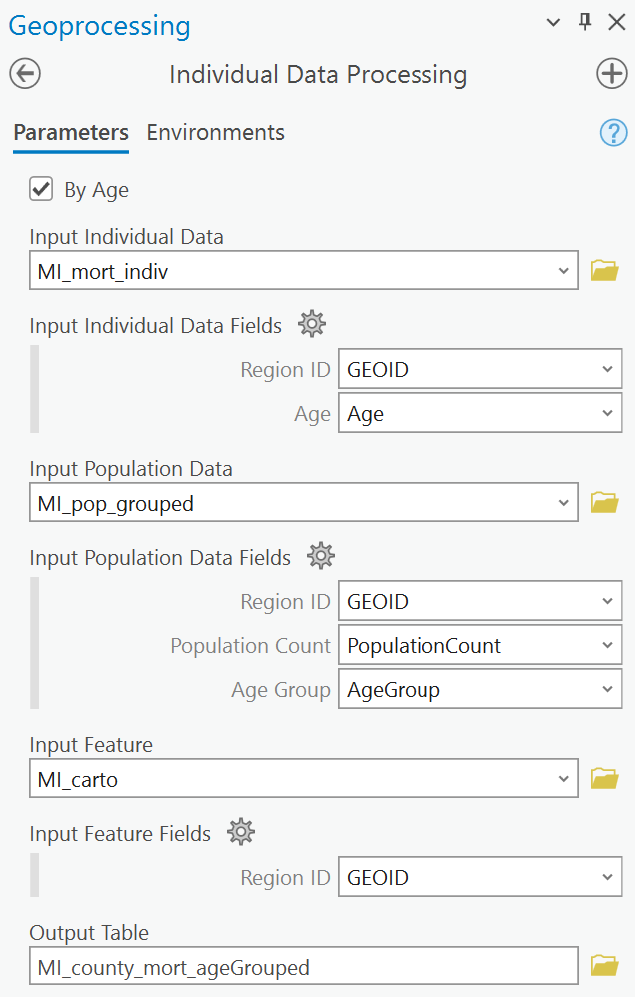
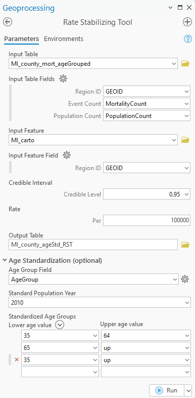

<h1 align="center">
    Rate Stabilizing Tool Tutorial
</h1>

#### Files needed for exercise: `RateStabilzingTool2_{versionNumber}.zip` 

#### Goal: Use the Rate Stabilizing Tool (RST) to produce easily mapped age-standardize, smoothed county estimates.

#### Objectives: 

-   Gain experience installing the tool and managing the user interface
-   Develop an understanding of the required data inputs; and
-   Interpret and map the output

## Loading The Toolbox
1.  Download the [latest release](https://github.com/CEHI-code-repos/RateStabilizingTool2/releases)  
    a.  Save the zipped file to your workspace 
    b.  Extract the zipped file to your workspace
2.  Create a new ArcGIS Pro Map Project
3.  Within the main ribbon, select **View** and open the **Catalog Pane**  
    
4.  Right click on the **Toolboxes** folder and select **Add Toolbox**  
    
5.  Navigate to the location where you extracted the toolbox and select `RST_v2.pyt`
6.  The Rate Stabilizing Toolbox will now appear; expand the toolbox to reveal the Individual Data Processing and Rate Stabilizing tools

## Adding Your Data
1.  Within the **Catalog Pane**, right click on the **Databases** folder and select **Add Database**  
    
2.  Navigate the tutorial folder of the extracted zip file and select `tutorial.gdb`; expand the toolbox to reveal the example datasets
3.  Right click on the `MI_mort_indiv` table and **Add to New** -> **Map**; repeat for **MI_pop_grouped** and **MI_carto**, but this time select **Add to Current Map**  
    
4.  Within the **Contents** pane, right click on each of the tables and click **Open**
5.  Notice that individual data table has only two fields
    -   *GEOID* - An unique identifier for the region in which a single event occured
    -   *Age* (Optional) - The age of the individual that the event occured to
6.  Notice that the population data table has three fields
    -   *GEOID* - An unique identifier for the region
    -   *AgeGroup* (Optional) - A specifier for the age group that the population count refers to
    -   *PopulationCount* - The population count for the region age group pairing

> [!IMPORTANT]  
> Age groups are restricted to the following: [“0-4”, “5-14”, “15-24”, “25-34”, “35-44”, “45-54”, “55-64”, “65-74”, “75-84”, “85up”] and must be spelled within the population data table **EXACTLY** as listed. The **Individual Data Processing** tool and **Rate Stabilizing Tool** will not run if provided invalid or mispelled groups.

> [!Note]  
> The age of individuals or the population are not necessary for generating crude rates with the Rate Stabilizing Tool. For an example of how population data without age groups should be formated, see `tutorial.gdb/MI_pop` 

## Individual Data Processing
1.  Open up the **Individual Data Processing** tool within the **Catalog** pane **Toolboxes** folder
2.  Notice the **By Age** checkbox; this checkbox determines whether the output dataset will be stratified by age group
3.  Fill in the **Input Individual Data** and **Input Individual Data Fields** with their respective values:
    -   **Input Individual Data** - `MI_mort_indiv`
    -   **Input Individual Data Fields**
        -   **Region ID** - *GEOID*
        -   **Age** - *Age*
4.  Fill in the **Input Population Data** and **Input Population Data Fields** with their respective values:
    -   **Input Population Data** - `MI_pop_grouped`
    -   **Input Population Data Fields**
        -   **Region ID** - *GEOID*
        -   **Population Count** - *PopulationCount*
        -   **Age Group** - *AgeGroup*
5.  A feature is required as a check on the individual and population data. Any regions within the individual and population data **MUST** be within the feature. Fill in the **Input Feature** and **Input Feature Fields** with their respective values:
    -   **Input Feature** - `MI_carto`
    -   **Input Feature Fields**
        -   **Region ID** - *GEOID*
6.  Name your **Output Table** `MI_county_mort_ageGrouped` and note its location; if your output table does not appear in the standalone tables automatically you may have to navigate to its location and add it in manually  
    
7.  Run the tool

> [!Important]  
> Both the Individual Data Processing and Rate Stabilizing tools were built to be noisy, which means they will warn frequently when they detect potential problems with the input data. Heed these warnings. It is often better to address the warnings than allow the tools to operate on assumptions of the data.
>
> The following are warnings you may encounter
> - *Repeated Input Population Data Region IDs were detected when By Age is unchecked* - The IDP will assume that these repeated regions were Age Groups referring to the same region and will sum them to get a total population for the region.
> - *Input Feature contains at least one region not present in the Input Population Data* - The IDP will assume that these regions have a population of 0.
> - *Event Count is greater than the Population Count for at least one row* - The IDP will not do anything

## Rate Stabilizing Tool
1.  Open up the **Rate Stabilizing Tool** script within the **Catalog** pane **Toolboxes** folder
2.  Fill in the **Input Table** and **Input Table Fields** with the table generated from the Individual Data Processing tool:
    -   **Input Table** - `MI_county_mort_ageGrouped`
    -   **Input Table Fields**
        -   **Region ID** - *GEOID*
        -   **Event Count** - *EventCount*
        -   **Population Count** - *PopCount*
2.  Fill in the **Input Table** and **Input Table Fields** with their respective values:
    -   **Input Feature** - `MI_county_mort_ageGrouped`
    -   **Input Feature Fields**
        -   **Region ID** - *GEOID*
3.  Fill in the **Input Feature** and **Input Feature Field** with the respective values:
	-   **Input Feature** - `MI_carto`
	-   **Input Feature Field**
		-   **Region ID** - *GEOID*
3.  The **Rate** paramter will determine the denominator of rates generated; we wil leave this at per 100,000
4.  Open the **Age Standardization** drop-down. This menu allows for the optional generation of age standardized rates. Fill the following fields with the following values:
    -   **Age Group Field** - *AgeGroup*
    -   **Standard Population Year** - 2010
    -   **Standard Age Groups**  
        | Lower Age Value | Upper Age Value |
        |-----------------|-----------------|
        | 35              | 64              |
        | 65              | up              |
        | 35              | up              |
    These settings will generate crude rates for each age group within the *AgeGroup* field, and age standardized rates for individuals 35 to 64, 65 and up, and 35 and up using the 2010 standard population. Not specifying these fields will generate crude rates for the total population.
5.  Name your **Output Table** `MI_county_ageStd_RST` and note its location; if your output table does not appear in the standalone tables automatically you may have to navigate to its location and add it in manually  
    
6.  Run the tool

## Understanding the output
1.  Within the **Contents** pane, right click on `MI_county_ageStd_RST` and click **Open**
2.  Notice that each age group has three columns:
    -   *median_{ageGroup}* - the estimated rate
    -   *maxCI_{ageGroup}* - the maximum confidence interval able to be generated for the estimate rate
    -   *reliable_{ageGroup}* - 1 = maximum confidence interval is greater than or equal to 0.95, 0 =  maximum confidence interval is less than 0.95
3.  At this point you are all set! Simply join your table to your feature and symbolize those areas with reliable estimates.
